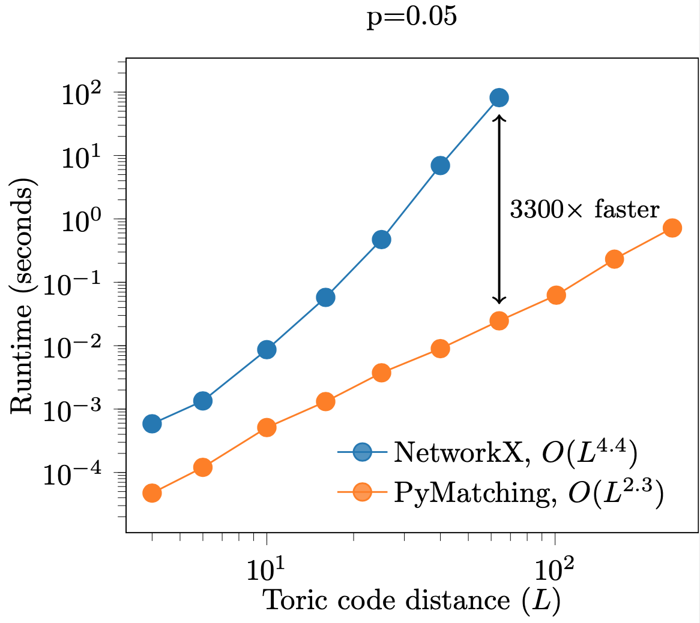

# PyMatching


PyMatching is a fast library for decoding quantum error correcting codes (QECC) using the Minimum Weight Perfect Matching (MWPM) decoder. PyMatching can decode codes for which each error generates a pair of syndrome defects (or only a single defect at a boundary). Codes that satisfy these properties include two-dimensional topological codes such as the [toric code](https://en.wikipedia.org/wiki/Toric_code), the [surface code](https://arxiv.org/abs/quant-ph/0110143) and [hyperbolic codes](https://arxiv.org/abs/1506.04029). PyMatching can handle boundaries, measurement errors and weighted edges in the matching graph. Since the core algorithms are written in C++, PyMatching is much faster than a pure Python NetworkX implementation.

[](https://travis-ci.org/github/oscarhiggott/PyMatching)
[](https://codecov.io/gh/oscarhiggott/PyMatching)

## Installation

Clone the repository (using the `--recursive` flag to include the lib/pybind11 submodule). Make sure you have cmake installed, and then use `pip` to install:
```
git clone --recursive https://github.com/oscarhiggott/PyMatching.git
pip install -e ./PyMatching
```

## Usage

In order to decode a parity check matrix `H` (a `scipy.sparse` matrix) with syndrome vector `z` (a bitstring which is a numpy array of dtype int), first construct the `Matching` object after importing it:
```
from pymatching import Matching
m = Matching(H)
```
Now to decode, simply run:
```
c = m.decode(z)
```
which outputs a bitstring `c`, which is a numpy array of ints corresponding to the minimum-weight correction. Note that the `m` by `n` parity check matrix `H` should correspond to the Z (or X) stabilisers of a CSS code with `n` qubits, `m` Z (or X) stabilisers, and with either one or two non-zero entries per column.

To decode instead in the presence of measurement errors, each stabiliser measurement is repeated `L` times, and decoding then takes place over a 3D matching graph (see Section IV B of [this paper](https://arxiv.org/abs/quant-ph/0110143)), which can be constructed directly from the check matrix `H` using:
```
m = Matching(H, repetitions=L)
```
and then decoded from an `m` by `L` numpy array syndrome `z` using:
```
c = m.decode(z)
```

The Matching object can also be constructed from a NetworkX graph instead of a check matrix, and can handle weighted edges. For full details see the documentation.

## Performance

While all the functionality of PyMatching is available via the Python bindings, the core algorithms and data structures are implemented in C++, with the help of the [BlossomV](https://pub.ist.ac.at/~vnk/software.html) and [Boost Graph](https://www.boost.org/doc/libs/1_74_0/libs/graph/doc/index.html) libraries. PyMatching also uses a local variant of the MWPM decoder (explained in the Appendix of [this paper](https://arxiv.org/abs/2010.09626)) that has a runtime that is approximately linear, rather than quadratic, in the number of nodes. As a result, PyMatching is orders of magnitude faster than a standard pure Python [NetworkX](https://networkx.org/documentation/stable/reference/algorithms/generated/networkx.algorithms.matching.max_weight_matching.html) implementation, as shown here for decoding the toric code under an independent noise model with p=0.05 and noiseless syndrome measurements:



## Licensing of Blossom V dependency

This package uses the Blossom V implementation of minimum weight perfect matching (downloaded from [here](https://pub.ist.ac.at/~vnk/software.html) upon installation) which is licenced for research purposes only. Commercial licensing options for Blossom V are available [here](https://xip.uclb.com/i/software/BlossomV.html).

## Attribution

When using PyMatching for research, please cite the BlossomV dependency:

        Vladimir Kolmogorov. "Blossom V: A new implementation of a minimum cost perfect matching algorithm."
        In Mathematical Programming Computation (MPC), July 2009, 1(1):43-67.
        
and please also consider citing:
```
@misc{higgott2020pymatching,
  author = {Higgott, Oscar},
  title = {{PyMatching}: A library for decoding quantum error correcting codes using minimum-weight perfect matching},
  year = {2020},
  publisher = {GitHub},
  journal = {GitHub repository},
  howpublished = {\url{https://github.com/oscarhiggott/PyMatching}}
}
```
