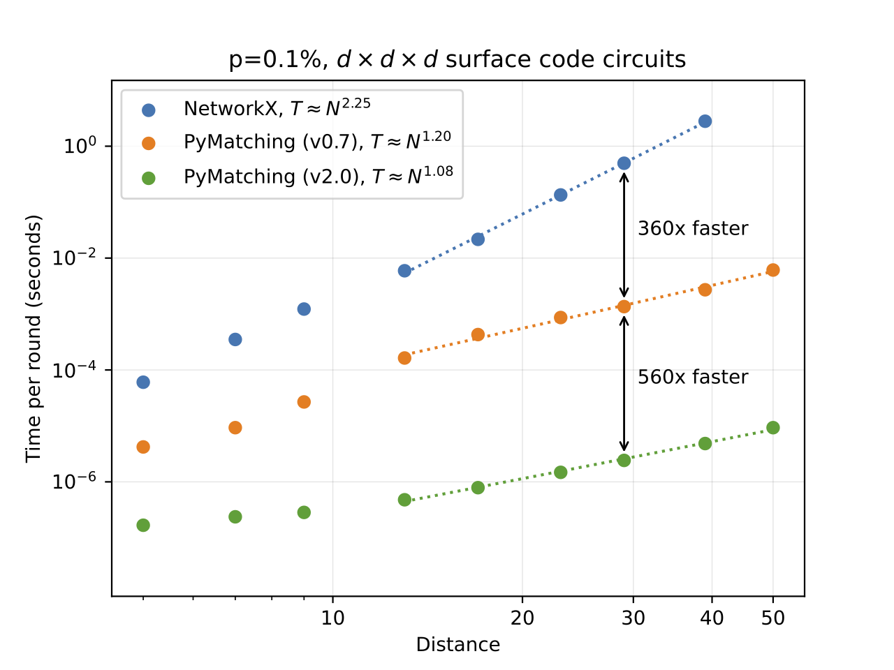
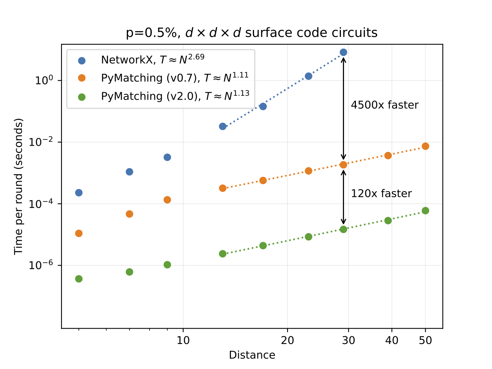

# PyMatching 2.0


[](https://codecov.io/gh/oscarhiggott/PyMatching)
[](https://readthedocs.org/projects/pymatching/builds/)
[](https://badge.fury.io/py/PyMatching)
[](http://unitary.fund)

PyMatching is a fast Python/C++ library for decoding quantum error correcting (QEC) codes using the Minimum Weight
Perfect Matching (MWPM) decoder.
Given the syndrome measurements from a quantum error correction circuit, the MWPM decoder finds the most probable set 
of errors, given the assumption that error mechanisms are _independent_, as well as _graphlike_ (each error causes 
either one or two detection events).
The MWPM decoder is the most popular decoder for decoding [surface codes](https://arxiv.org/abs/quant-ph/0110143), 
and can also be used to decode various other code families, including 
[subsystem codes](https://arxiv.org/abs/1207.1443), 
[honeycomb codes](https://quantum-journal.org/papers/q-2021-10-19-564/) and 
[2D hyperbolic codes](https://arxiv.org/abs/1506.04029).

Version 2.0 includes a new implementation of the blossom algorithm which is **100-1000x faster** than previous versions
of PyMatching. 
PyMatching can be configured using arbitrary weighted graphs, with or without a boundary, and can be combined with 
Craig Gidney's [Stim](https://github.com/quantumlib/Stim) library to simulate and decode error correction circuits 
in the presence of circuit-level noise. The [sinter](https://pypi.org/project/sinter/) package combines Stim and 
PyMatching to perform fast, parallelised monte-carlo sampling of quantum error correction circuits.

Documentation for PyMatching can be found at: [pymatching.readthedocs.io](https://pymatching.readthedocs.io/en/stable/)

## The new >100x faster implementation for Version 2.0

Version 2.0 features a new implementation of the blossom algorithm, which I wrote with Craig Gidney.
Our new implementation, which we refer to as the _sparse blossom_ algorithm, can be seen as a generalisation of the 
blossom algorithm to handle the decoding problem relevant to QEC. 
We solve the problem of finding minimum-weight paths between detection events in a detector graph 
_directly_, which avoids the need to use costly all-to-all Dijkstra searches to find a MWPM in a derived 
graph using the original blossom algorithm.

Our new implementation is **over 100x faster** than previous versions of PyMatching, and is 
**over 100,000x faster** than NetworkX (benchmarked with surface code circuits). 
At 0.1% circuit-noise, PyMatching v2.0 can decode a distance 19 surface code in less than 1 microsecond per 
measurement round. The runtime is approximately linear in the size of the graph.

The benchmarks in the two plots below (run on an M1 chip) compare the performance of PyMatching v2.0 with the previous 
version (v0.7) as well as with NetworkX for decoding surface code circuits with circuit-level depolarising noise. 
The equations T=N^x in the legends (and plotted as dashed lines) are obtained from a fit to the same data for 
distance > 10, where N is the number of detectors (nodes) per round, and T is the decoding time per round.

|                              Decoding time per round for p=0.1% circuit-level noise                              |                                  Decoding time per round for p=0.5% circuit-level noise                                   |
|:----------------------------------------------------------------------------------------------------------------:|:-------------------------------------------------------------------------------------------------------------------------:|
 |  |  |


## Installation

The latest version of PyMatching can be downloaded and installed from [PyPI](https://pypi.org/project/PyMatching/) 
with the command:

```
pip install -U pymatching
```


## Usage


In order to decode a parity check matrix `H` (a `scipy.sparse` matrix) with syndrome vector `z` (a bitstring which is a
numpy array of dtype int), first construct the `Matching` object after importing it:

```
from pymatching import Matching
m = Matching(H)
```

Now to decode, simply run:

```
c = m.decode(z)
```

which outputs a bitstring `c`, which is a numpy array of ints corresponding to the minimum-weight correction. Note that
the `m` by `n` parity check matrix `H` should correspond to the Z (or X) stabilisers of a CSS code with `n` qubits, `m`
Z (or X) stabilisers, and with either one or two non-zero entries per column.

To decode instead in the presence of measurement errors, each stabiliser measurement is repeated `L` times, and decoding
then takes place over a 3D matching graph (see Section IV B of [this paper](https://arxiv.org/abs/quant-ph/0110143)),
which can be constructed directly from the check matrix `H` using:

```
m = Matching(H, repetitions=L)
```

and then decoded from an `m` by `L` numpy array syndrome `z` using:

```
c = m.decode(z)
```

Instead of using a check matrix, the Matching object can also be constructed using
the [`Matching.add_edge`](https://pymatching.readthedocs.io/en/stable/api.html#pymatching.matching.Matching.add_edge)
method or by loading from a NetworkX graph. PyMatching supports arbitrary graphs, including weighted edges and boundary
nodes.

PyMatching can be used with [Stim](https://github.com/quantumlib/Stim) for circuit-level simulations of quantum error
correction protocols. Stim is a powerful tool that can automatically construct matching graphs just from the definition
of the annotated stabiliser circuit used for stabiliser measurements. Stim can also be used to sample from the
stabiliser measurement circuits. The
Stim ["getting started" notebook](https://github.com/quantumlib/Stim/blob/main/doc/getting_started.ipynb) contains an
example that uses Stim and PyMatching to estimate the circuit-level threshold of a quantum error correcting code.

For more details on how to use PyMatching,
see [the documentation](https://pymatching.readthedocs.io/en/stable/usage.html).

## Attribution

A paper on our new implementation used in PyMatching version 2.0 (sparse blossom) will be published soon. In the meantime, please 
cite:

```asm
@misc{pymatchingv2,
  author = {Higgott, Oscar and Gidney, Craig},
  title = {PyMatching v2},
  year = {2022},
  publisher = {GitHub},
  journal = {GitHub repository},
  howpublished = {\url{https://github.com/oscarhiggott/PyMatching}}
}
```

Note: the existing PyMatching [paper](https://arxiv.org/abs/2105.13082) descibes the implementation in version 0.7 and 
earlier of PyMatching (not v2.0).

## Acknowledgements

We are grateful to the Google Quantum AI team for supporting the development of PyMatching v2.0.