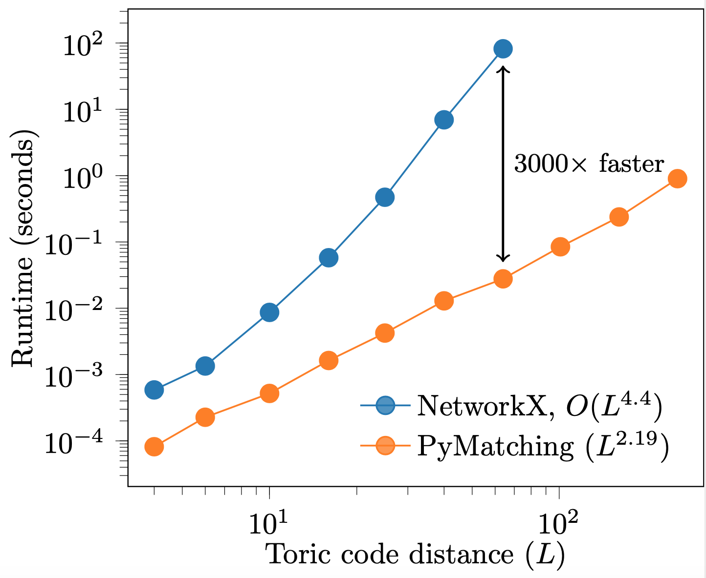

.. PyMatching documentation master file, created by
   sphinx-quickstart on Fri Oct 23 12:16:16 2020.
   You can adapt this file completely to your liking, but it should at least
   contain the root `toctree` directive.

PyMatching
==========

PyMatching is a Python library for decoding quantum codes with the 
minimum-weight perfect matching (MWPM) decoder, and is designed to 
be fast and easy to use. 

While a Python library such as NetworkX can also be used to 
implement MWPM, it is far too slow to be used for large 
fault-tolerance simulations, which often require 
matching graphs with many thousands of nodes. On the other hand, 
the excellent C++ BlossomV library is fast, but using it to decode 
quantum codes also requires path-finding algorithms, which must 
also be implemented in C++ for a fast implementation. Furthermore, 
attempting to solve the full matching problem even with BlossomV 
can become prohibitively expensive for matching graphs with more 
than a few thousand nodes, since the average complexity is 
empirically roughly quadratic in the number of nodes. 
PyMatching is intended to provide the best of both 
worlds: the algorithms and data structures are implemented 
in C++ for good performance (with the help of BlossomV and the Boost Graph library), 
using a local variant of the matching decoder given in the 
Appendix of https://arxiv.org/abs/2010.09626, which empirically 
has an average runtime roughly linear in the number of nodes 
and gives the same output as full matching in practice.
Furthermore, Python bindings are provided for all the 
core functionality of PyMatching, making it easy to use 
in conjunction with numpy, scipy and NetworkX.
PyMatching can be applied to any quantum code for which 
defects come in pairs (or in isolation at a boundary), 
and does not require knowledge of the specific geometry 
used.

Compared to a pure Python NetworkX implementation of MWPM, PyMatching 
can be orders of magnitude faster, as shown here for the 
toric code under an independent noise model at :math:`p=0.5`:

.. toctree::
   :maxdepth: 2
   :caption: Contents:

   installation
   usage.ipynb
   api
   

Indices and tables
==================

* :ref:`genindex`
* :ref:`modindex`
* :ref:`search`
